# n8n Automation Portfolio

A collection of n8n workflows built for real business use cases — lead management, document processing, HR screening, AI agents, and customer communication.

Each folder contains a ready-to-import `workflow.json` and a screenshot of the canvas. Grab any workflow, drop it into your own n8n instance, and connect your own credentials.

## Workflows

| Preview | Workflow | What it does | Stack |
|---|---|---|---|
| 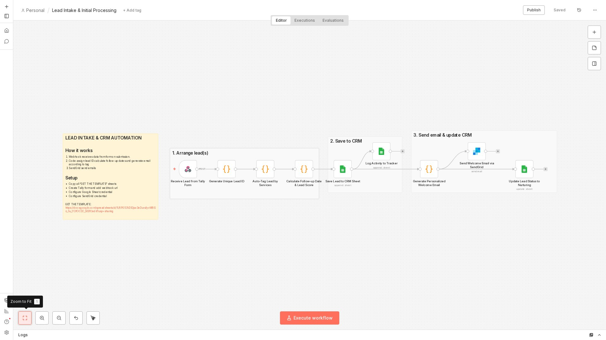 | [Lead Intake CRM](./lead-intake-crm) | Pulls form submissions straight into your CRM — no manual entry | Tally Forms, Google Sheets |
| 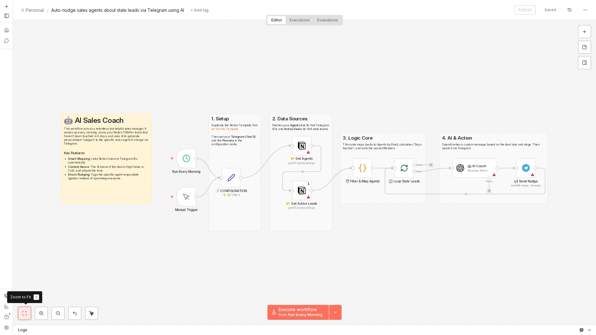 | [Stale Lead Nudges](./stale-lead-nudges) | Pings you when a lead's gone quiet for too long | Notion CRM, Telegram |
| 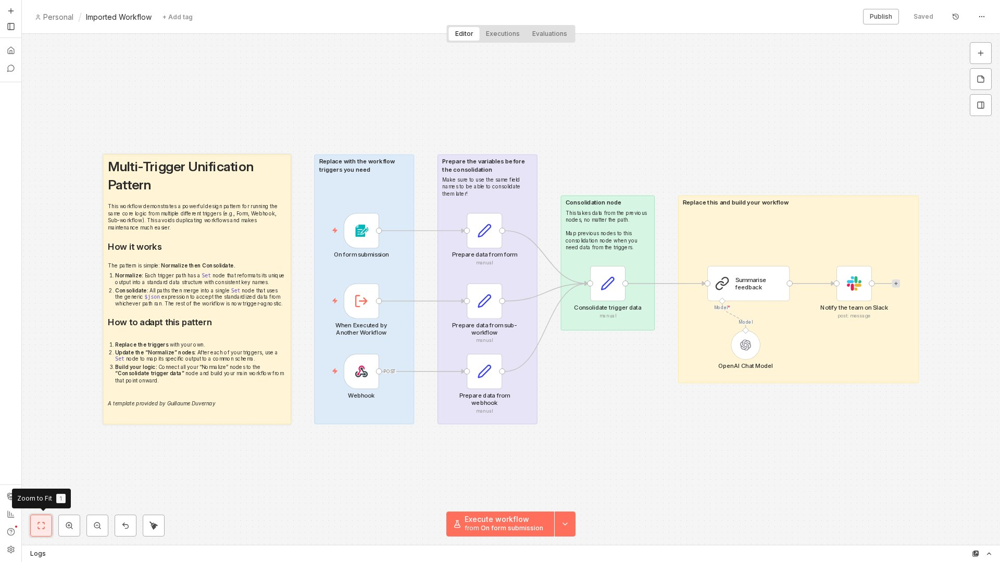 | [Multi-Source Feedback Processing](./feedback-processing) | Collects feedback from multiple channels and alerts the team | OpenAI, Slack |
| 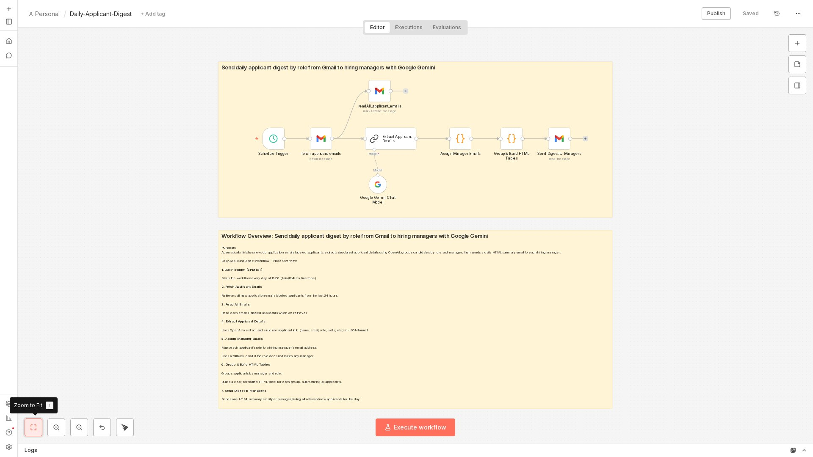 | [Daily Applicant Digest](./applicant-digest) | Sends a daily rundown of new candidates by role | Gemini AI, Gmail |
| 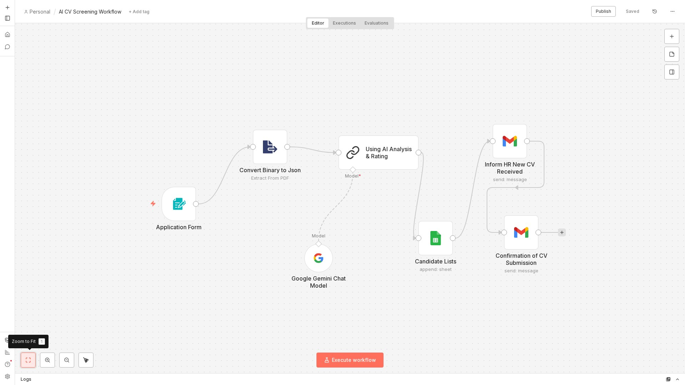 | [Screen Applicants with AI](./screen-applicants) | Screens resumes, notifies HR, logs everything to a sheet | AI Agent, Google Sheets |
| 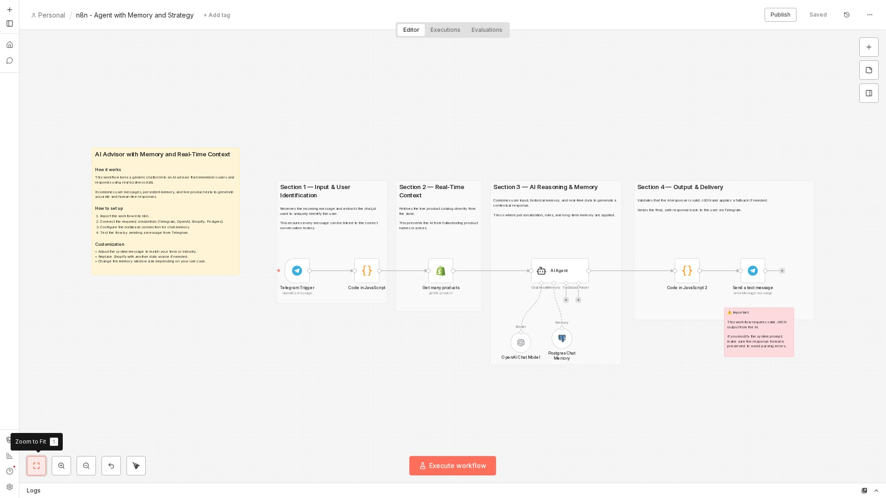 | [Telegram Advisor Bot](./telegram-advisor-bot) | Chat assistant that actually remembers the conversation | Telegram, GPT-4o-mini, Postgres |
| 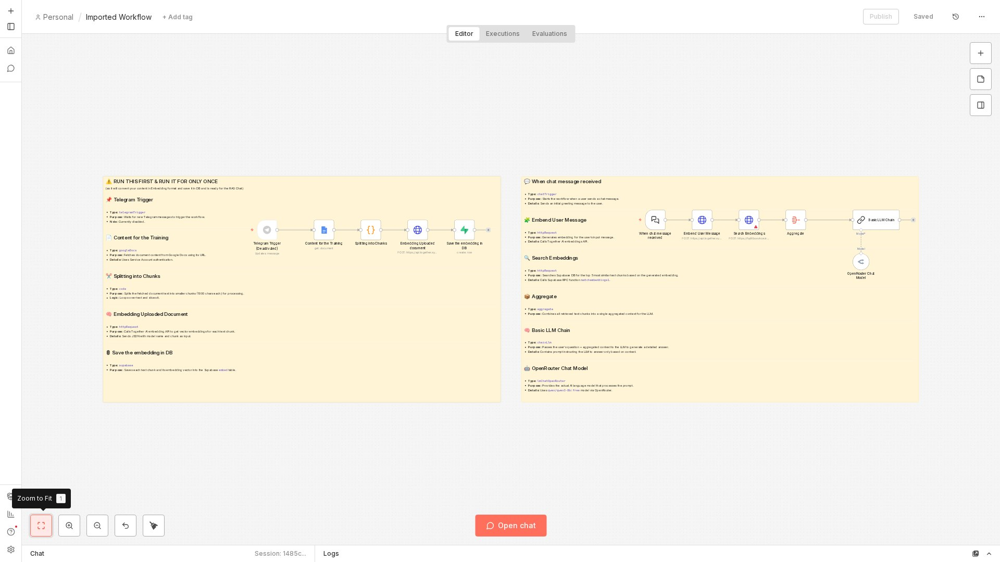 | [RAG Chatbot](./rag-chatbot) | Answers questions from your own knowledge base | Supabase, TogetherAI, OpenRouter |
| 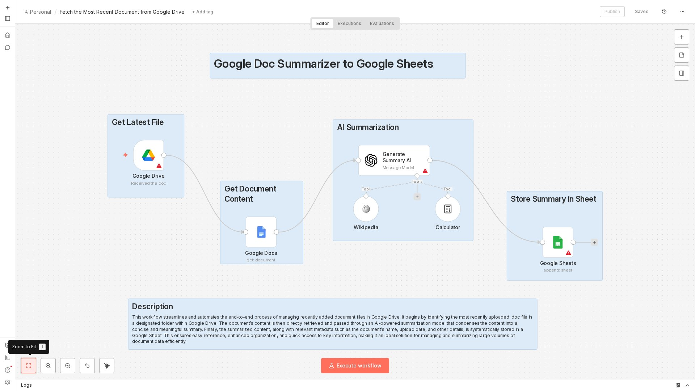 | [Document Summarizer](./document-summarizer) | Auto-summarizes new documents as they land | Google Drive |
| 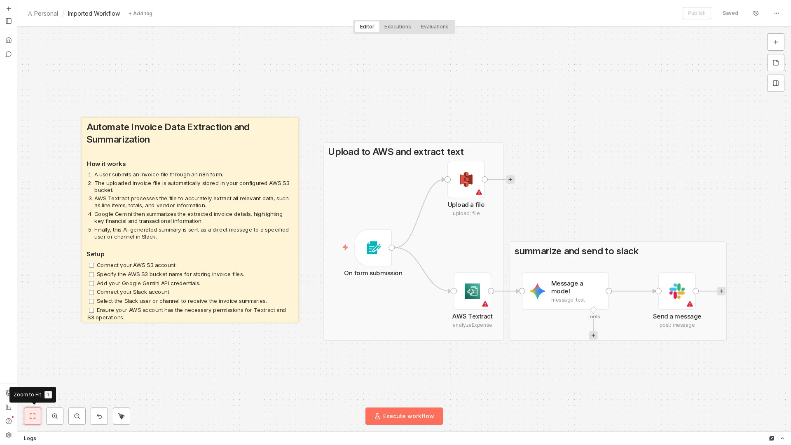 | [Invoice Processing](./invoice-processing) | Reads and summarizes invoices automatically | AWS Textract, Gemini |
| 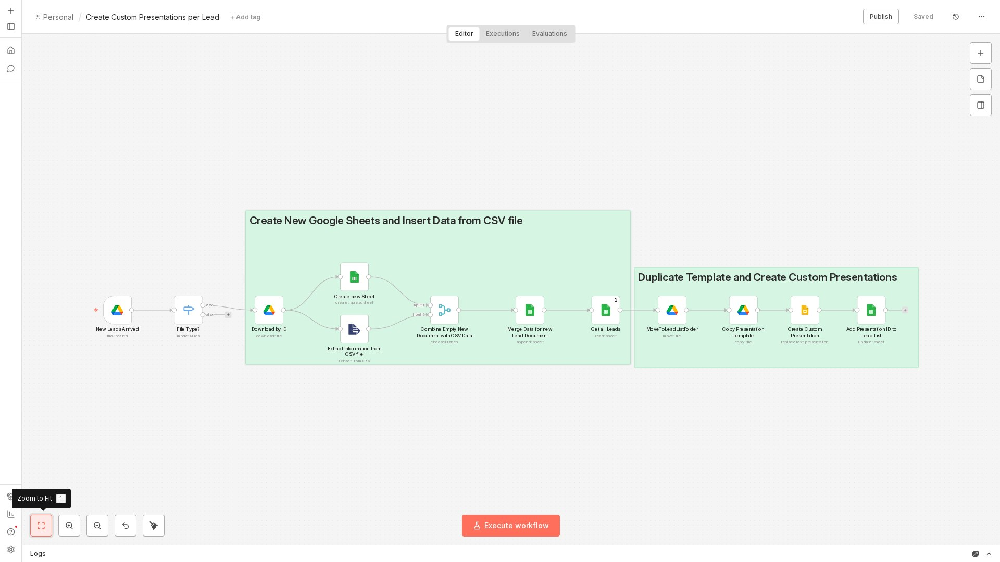 | [Slides Generator](./slides-generator) | Turns a CSV into a finished slide deck | Google Slides |
| 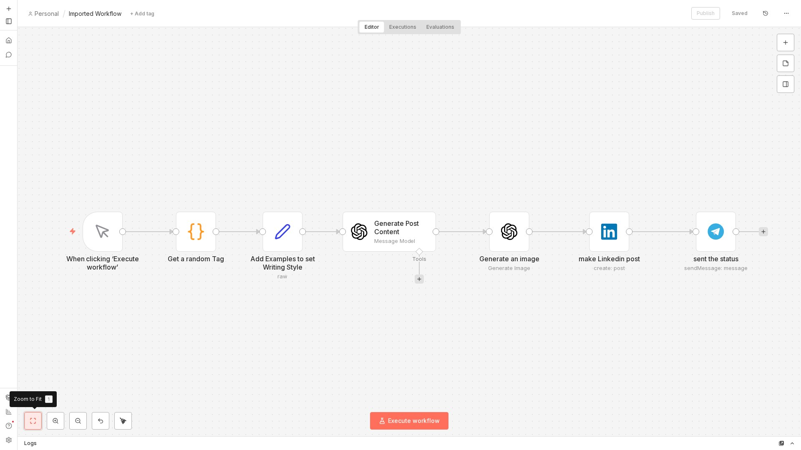 | [LinkedIn Auto-Posting](./linkedin-auto-posting) | Drafts posts and generates matching images | GPT-4o, Telegram |
| 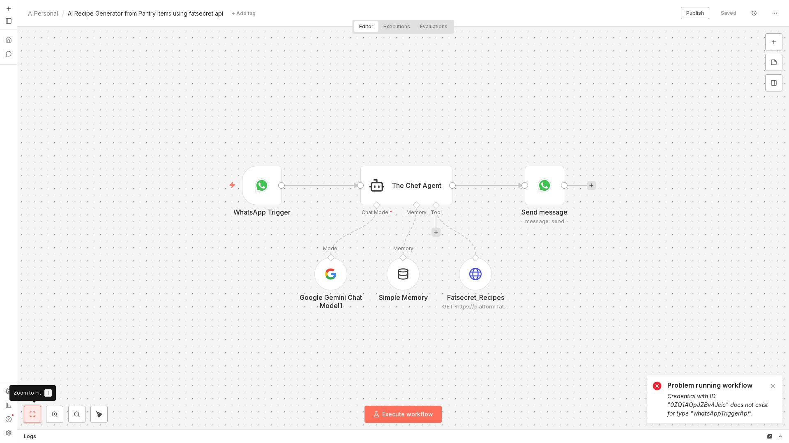 | [WhatsApp AI Assistant](./whatsapp-assistant) | A consultation bot framework — easy to adapt to any niche | WhatsApp, Gemini AI |

## Gallery

<table>
<tr>
<td align="center"> <b>Lead Intake CRM</b></td>
<td align="center"> <b>Stale Lead Nudges</b></td>
</tr>
<tr>
<td align="center"> <b>Feedback Processing</b></td>
<td align="center"> <b>Applicant Digest</b></td>
</tr>
<tr>
<td align="center"> <b>Screen Applicants</b></td>
<td align="center"> <b>Telegram Advisor Bot</b></td>
</tr>
<tr>
<td align="center"> <b>RAG Chatbot</b></td>
<td align="center"> <b>Document Summarizer</b></td>
</tr>
<tr>
<td align="center"> <b>Invoice Processing</b></td>
<td align="center"> <b>Slides Generator</b></td>
</tr>
<tr>
<td align="center"> <b>LinkedIn Auto-Posting</b></td>
<td align="center"> <b>WhatsApp AI Assistant</b></td>
</tr>
</table>

## How to use a workflow

1. Open the folder you're interested in
2. Download `workflow.json`
3. In n8n: Workflows → Import from File
4. Plug in your own credentials for the services it uses
5. Turn it on

## Contact

[your Telegram / LinkedIn / email]
